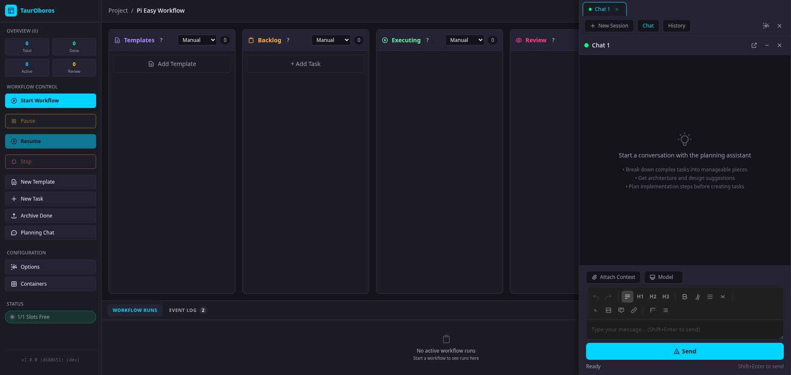

# TaurOboros

TaurOboros is an agent orchestration system, that uses a Kanban style board to visualize, organize and manage tasks that can them be delegate to agents.

[Features](#features) • [Screenshots](#screenshots) • [Quick Start](#quick-start) • [Commands](#available-commands) • [Configuration](#configuration) • [Architecture](#technical-architecture)



> [!NOTE]
> If you use OpenCode and don't want to change, you can try [opencode-easy-workflow](https://github.com/jmarceno/opencode-easy-workflow), altough if does not support all features of TaurOboros, it is still the same tool at its core.

## Features

### Task Management
- **Kanban Board** – Visual task management with columns for templates, backlog, executing, review, done, and failed states
- **Task Dependencies** – Define requirements between tasks to ensure proper execution order

### AI Execution Modes
- **Standard Execution** – Direct AI agent execution with full access to tools and file system
- **Plan Mode** – Discuss with to AI create an implementation plan that you can them ask the AI to transform in boards tasks for execution.
- **Review Loops** – Automatic code review with iterative fixes until quality criteria are met
- **Best-of-N Strategy** – Run multiple AI workers in parallel, have reviewers evaluate results, and automatically select or synthesize the best implementation

### Quality Assurance
- **Automated Reviews** – AI-powered code review that checks for bugs, security issues, and completeness
- **Code Style Review** – Describe the code style you want to enforced in the code, an agent validades and apply those rules after Review phase is done.
- **Configurable Review Cycles** – Set how many review iterations each task should undergo
- **Smart Repair** – Automatic detection and recovery from failed or stuck task states
- **Self Healing** – When in Dev mode, Tauroboros use an AI agent to diagnostics task failures, analyzes root causes, and proposes permanent source-code fixes

### Isolation & Security
- **Git Worktree Isolation** – Each task runs in its own git worktree for clean separation
- **Container Isolation** – Run AI agents inside Podman containers for filesystem and port isolation (can be disabled if you need to run native)
- **Automatic Cleanup** – Worktrees and resources are cleaned up after successful task completion

### Monitoring & Observability
- **Session Logging** – Full capture of all AI interactions with token usage and cost tracking
- **Execution Graph Visualization** – See task dependencies and parallelization opportunities
- **Telegram Notifications** – Get notified when tasks complete or fail

## Quick Start

### Prerequisites
- [Bun](https://bun.sh/) runtime (for development and building)
- Git repository (project must be in a git repo)
- Pi AI agent binary (for AI execution)

### Installation

Download the Bun compiled binary from the releases page and run it from inside your project directory. (It must be a inited Git repo for workflows to be able to start)

```bash
# Install dependencies (Bun for backend)
./path/to/exec/tauroroboros

```

### Running the Dev server from project repo

```bash
# Start the server (backend + kanban UI)
bun run start

# Or run in development mode with auto-reload
bun run dev
```

The server will start on port `3789` by default (configurable in `.pi/settings.json`). Open `http://localhost:3789` in your browser.

**Note:** The kanban frontend (Vue app in `src/kanban-vue/`) has its own package.json and uses npm. The root Bun scripts (`bun run start`, `bun run build`) automatically handle building the frontend for you.

### How to Compile from the project directory (Standalone Distribution)

You can compile the entire application into a single executable binary for easy distribution:

```bash
# Compile into a single binary (~66 MB)
bun run compile

# The binary is created as ./tauroboros
./tauroboros

# Run on a custom port
SERVER_PORT=3790 ./tauroboros

# Validate the compiled binary works correctly
bun run compile:test
```

**Binary Features:**
- Single file executable (~66 MB) with all frontend assets embedded
- No dependencies required at runtime (just the binary)
- Supports all the same features as the Bun runtime version
- Runtime data (database, settings) stored in `./.pi/` directory
- Environment variable support: `SERVER_PORT` to customize port

### Basic Usage

1. **Create a Task** – Click "New Task" in the kanban board
2. **Configure Options** – Set execution model, branch, and enable/disable features like plan mode, review, auto-commit
3. **Add to Backlog** – Task appears in the backlog column
4. **Start Execution** – Click the play button or "Start All" to execute all backlog tasks
5. **Monitor Progress** – Watch real-time updates as the AI works through your tasks

### Container Isolation (Default)

For enhanced security and isolation, run AI agents inside Podman containers:

```bash
# 1. Install prerequisites (Podman required)
./scripts/setup-e2e-tests.sh

# 2. Verify setup
bun run container:verify

# 3. Enable container mode by editing .pi/settings.json:
# Set workflow.container.enabled to true

# 4. Run as normal - agents now run in isolated containers
bun run src/index.ts
```

This process will be done automatically to you if you have Podman installed the first time you run Tauroboros in project directory.

#### Docker Compose Support

To run `docker-compose` inside task containers (e.g., for databases), enable podman socket mounting:

```bash
# 1. Enable podman socket on host
systemctl --user enable podman.socket
systemctl --user start podman.socket

# 2. Add to .tauroboros/settings.json:
# "workflow.container.mountPodmanSocket": true

# 3. Now docker-compose works inside task containers
```

**Note:** This reduces container isolation—task containers can see/start any host container.

## Available Commands

All commands use **Bun** (the kanban frontend build uses npm internally, handled automatically):

```bash
# Start server (production)
bun run start

# Development mode with auto-reload
bun run dev

# Build everything (backend + kanban frontend)
bun run build

# Compile to single binary (standalone distribution)
bun run compile             # Create ./tauroboros binary
bun run compile:test        # Validate compiled binary

# Run unit tests
bun test

# Run tests with coverage
bun test --coverage

# Run E2E tests (requires server running)
bun run test:e2e
bun run test:e2e:ui       # With UI mode
bun run test:e2e:real     # Real container workflow test

# Kanban frontend (uses npm internally)
bun run kanban:dev        # Dev mode with hot reload
bun run kanban:build      # Production build

# Skills management
bun run skills:install    # Sync skills to .pi/skills
bun run skills:verify     # Verify Pi setup
bun run setup             # Install + verify

# Container setup (optional Podman isolation)
bun run container:setup      # Install Podman and build image
bun run container:verify     # Check container runtime setup
bun run container:build      # Build pi-agent container image
bun run container:cleanup    # Remove container configuration
```

## Configuration

All infrastructure-level configuration is stored in `.pi/settings.json`. This file is created automatically when you run `bun run setup` and comes pre-populated with sensible defaults.

### Settings.json Structure

```json
{
  "skills": {
    "localPath": "./skills",
    "autoLoad": true,
    "allowGlobal": false
  },
  "project": {
    "name": "your-project-name",
    "type": "workflow"
  },
  "workflow": {
    "server": {
      "port": 3789,
      "dbPath": ".tauroboros/tasks.db"
    },
    "container": {
      "enabled": true,
      "piBin": "pi",
      "piArgs": "--mode rpc",
      "image": "pi-agent:alpine",
      "imageSource": "dockerfile",
      "dockerfilePath": "docker/pi-agent/Dockerfile",
      "registryUrl": null,
      "autoPrepare": true,
      "memoryMb": 512,
      "cpuCount": 1,
      "portRangeStart": 30000,
      "portRangeEnd": 40000
    }
  }
}
```

### Configuration Sections

| Section | Description |
|---------|-------------|
| `workflow.server.port` | HTTP server port (default: 3789) |
| `workflow.server.dbPath` | SQLite database path relative to project root |
| `workflow.container.enabled` | Enable container isolation |
| `workflow.container.piBin` | Path to Pi binary (default: "pi") |
| `workflow.container.piArgs` | Additional arguments for Pi CLI |
| `workflow.container.image` | Container image for agents |
| `workflow.container.memoryMb` | Memory limit per container |
| `workflow.container.cpuCount` | CPU limit per container |
| `workflow.container.portRangeStart` | Host port allocation range start |
| `workflow.container.portRangeEnd` | Host port allocation range end |
| `workflow.container.mountPodmanSocket` | Mount podman socket for docker-compose support |

### Task-Level Configuration

Task execution settings (models, prompts, review settings, etc.) are stored in the database and can be configured via the web UI or API at `/api/options`. These include:
- **Models** – Plan, execution, review, and repair models
- **Telegram Notifications** – Bot token, chat ID, and enable/disable
- **Execution Settings** – Max reviews, parallel tasks, thinking level
- **Prompts** – Commit prompt template, extra prompt

Each task can also be individually configured with:

Each task can be configured with:
- **Plan Mode** – AI creates a plan before implementation
- **Auto-approve Plan** – Skip manual plan approval
- **Review** – Enable automated code review
- **Auto-commit** – Automatically commit changes after completion
- **Delete Worktree** – Clean up worktree after task completes
- **Thinking Level** – Control AI reasoning depth: `low`, `medium`, `high`
- **Execution Strategy** – `standard` or `best_of_n`

---

## Technical Architecture

### Runtime Model
- One Pi RPC process per workflow-owned session
- Full raw capture to database (`session_io`) for stdin/stdout/stderr/lifecycle/snapshots/prompts
- Normalized projection in `session_messages` for structured querying
- Prompt templates are database-backed (`prompt_templates`)
- Skills are file-based and synced into `.pi/skills/`

### Architecture Pattern
The application uses an **Effect-first** architecture:

- **Effect Services**: All async operations return `Effect.Effect<T, E>` values
- **Layer Composition**: Application assembly uses `Layer` from the Effect library
- **Tagged Errors**: Domain errors use `Schema.TaggedError` for typed failure handling
- **Scoped Resources**: Long-lived resources use `Effect.acquireRelease` for lifecycle management
- **Structured Logging**: All logging uses `Effect.log*` for observability

**Runtime Boundaries**: Effects are only executed at approved boundaries:
- Backend entrypoint (`src/index.ts`)
- Bun HTTP adapter (`src/server/router.ts`)
- Frontend UI boundary (`src/kanban-solid/src/api/client.ts`)
- Test harness

### Database Schema
The system uses SQLite with tables for:
- `tasks` – Task definitions and state
- `workflow_runs` – Execution run tracking
- `task_runs` – Individual task execution instances (for Best-of-N)
- `task_candidates` – Candidate implementations from workers
- `workflow_sessions` – AI session metadata
- `session_messages` – Structured message logs
- `session_io` – Raw I/O capture
- `options` – Global configuration
- `prompt_templates` – Database-backed prompt templates

### API Endpoints

The server exposes a comprehensive REST API:
- `GET/POST/PUT/DELETE /api/tasks` – Task CRUD operations
- `GET/PUT /api/options` – Global configuration
- `GET /api/branches` – Git branch listing
- `GET /api/models` – Available AI models
- `POST /api/start` – Start workflow execution
- `POST /api/stop` – Stop execution
- `GET /api/execution-graph` – Dependency visualization
- `GET /api/sessions/:id/messages` – Session message logs
- WebSocket at `/ws` for real-time updates

### Project Structure

```
src/
├── index.ts              # Entry point (Effect runtime boundary)
├── server.ts             # HTTP server setup (Layer composition)
├── orchestrator.ts       # Workflow execution orchestration (Effect-native)
├── db.ts                 # Database layer (Effect-based)
├── types.ts              # TypeScript type definitions
├── execution-plan.ts     # Dependency resolution
├── task-state.ts         # Task state machine
├── kanban-solid/         # Solid JS kanban UI (Vite + Tailwind)
│   ├── package.json      # Frontend dependencies (npm)
│   ├── vite.config.ts
│   └── src/
│       ├── App.tsx
│       ├── api/          # Effect-based API client
│       ├── stores/       # Effect-based state management
│       └── components/
├── server/               # HTTP server implementation
│   ├── router.ts         # URL routing
│   ├── server.ts         # Route handlers
│   ├── route-interpreter.ts  # Central Effect route interpreter
│   ├── websocket.ts      # WebSocket hub
│   ├── types.ts          # Server types (Effect-based)
│   └── routes/           # Route handlers (Effect-based)
├── runtime/              # Execution runtime (Effect-native)
│   ├── session-manager.ts
│   ├── planning-session.ts
│   ├── pi-process.ts
│   ├── container-pi-process.ts
│   ├── container-manager.ts
│   ├── container-image-manager.ts
│   ├── global-scheduler.ts
│   ├── worktree.ts
│   ├── best-of-n.ts      # Best-of-N strategy
│   ├── review-session.ts
│   ├── smart-repair.ts
│   └── self-healing.ts
├── shared/               # Shared utilities
│   ├── errors.ts        # Domain errors (Schema.TaggedError)
│   ├── logger.ts        # Logging service
│   ├── services.ts      # Service tags (Context.GenericTag)
│   └── error-codes.ts   # Error codes
├── prompts/              # Prompt templates
├── db/                   # Database migrations and types
└── recovery/             # Startup recovery logic
```

# Acknowledgements

- [cline](https://github.com/cline/cline "Cline") for Inspiring me. Pay them a visit and test their solution Kanban solution too.
- [coding-agent](https://github.com/badlogic/pi-mono/tree/main/packages/coding-agent "pi") for being a pretty cool and flexible piece of software to build around.