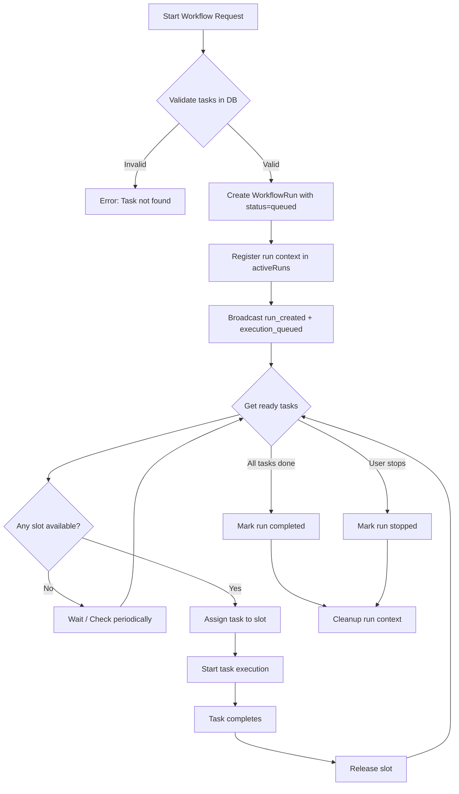
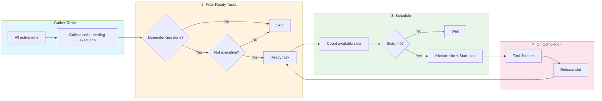
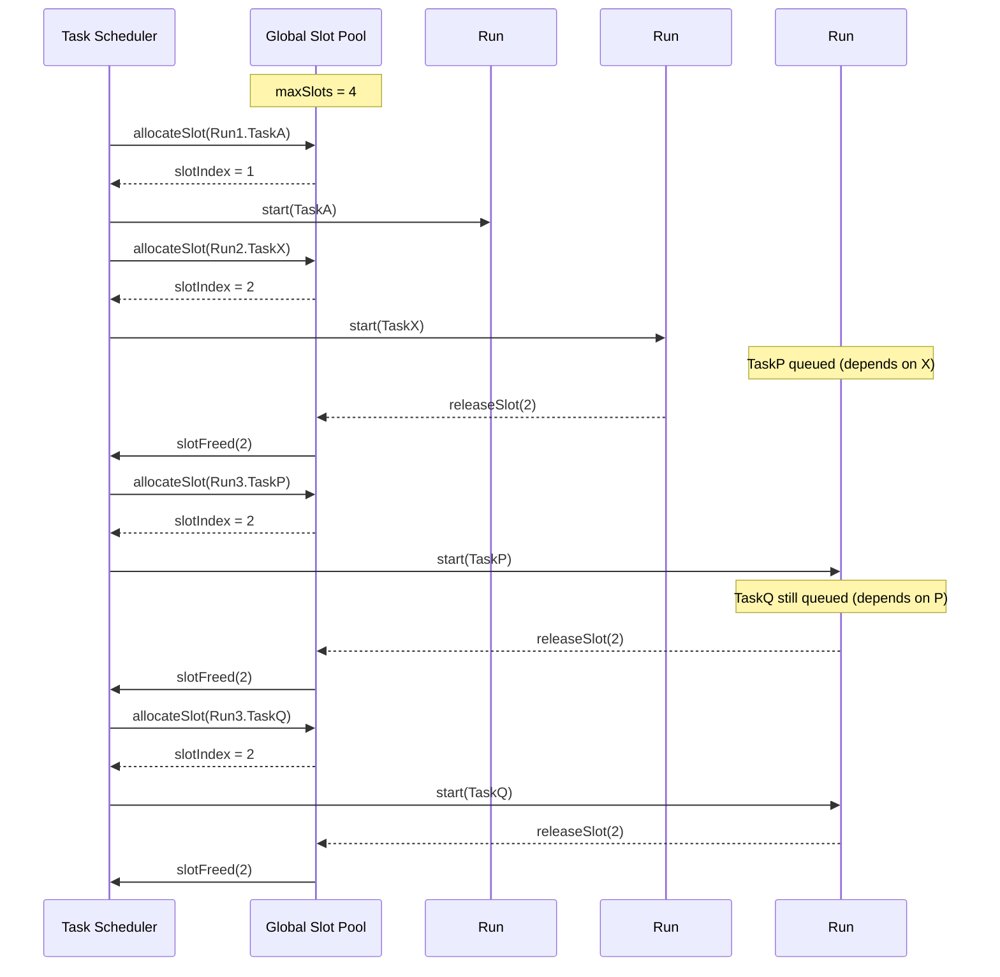

# Multi-Workflow Parallel Execution Implementation Plan

## Overview

This document defines the implementation plan to transform TaurOboros from a single-workflow system (one workflow at a time, multiple parallel tasks within) into a multi-workflow system (multiple workflows simultaneously, global slot pool with task-level parallelism).

## Current State vs. Design Intent

### Current Implementation

```
┌─────────────────────────────────────────────────────────────┐
│                      ORCHESTRATOR                           │
│  running: boolean (single flag)                              │
│  currentRunId: string (single ID)                            │
├─────────────────────────────────────────────────────────────┤
│                                                              │
│  Workflow Run #1                                             │
│  ├── Task A (parallel slot 1) ──────────────────┐            │
│  ├── Task B (parallel slot 2) ─────┐             │            │
│  └── Task C (depends on B)         │             │            │
│                                   ▼             ▼            │
│  Workflow Run #2 ─── BLOCKED until #1 completes  │            │
│                                                              │
└─────────────────────────────────────────────────────────────┘
```

**Problem**: Only ONE workflow can run at a time. Starting a second workflow throws "Already executing" error.

### Design Intent

```
┌─────────────────────────────────────────────────────────────┐
│                      GLOBAL SLOT POOL                       │
│  parallelTasks = 4 (system-wide limit)                       │
├─────────────────────────────────────────────────────────────┤
│                                                              │
│  Workflow #1 ──┬── Task A (slot 1)                           │
│               ├── Task B (slot 2)                           │
│               │                                              │
│  Workflow #2 ─┼── Task X (slot 3)                            │
│               │                                              │
│  Workflow #3 ─┼── Task P (slot 4) ── WAITING (no slot)       │
│               │                                              │
│               └── Task Q ── WAITING ── depends on P          │
│                                                              │
│  Task P completes → frees slot 3 → Task Q starts              │
│                                                              │
└─────────────────────────────────────────────────────────────┘
```

**Core principles**:
1. Multiple workflows can run simultaneously
2. `parallelTasks` is a **global pool** shared across ALL workflows
3. Tasks wait for slots; they do not block workflow starting
4. **Independence guarantee**: If task B depends on task A, B starts ONLY after A completes and a slot is available
5. No task ever starts before its dependencies complete

---

## Architecture Changes

### 1. Remove Single-Workflow Lock

Replace the boolean `running` flag with a map of active runs:

```typescript
// Before
private running = false
private currentRunId: string | null = null

// After
private activeRuns = new Map<string, RunContext>()
private activeTasks = new Map<string, TaskExecutionState>()  // For slot tracking
```

### 2. Define RunContext

```typescript
interface RunContext {
  id: string
  kind: WorkflowRunKind
  status: WorkflowRunStatus
  displayName: string
  targetTaskId: string | null
  groupId?: string
  createdAt: number
  startedAt: number
  finishedAt: number | null
  // Tasks in this run, tracking their execution state
  taskIds: string[]
}
```

### 3. Define TaskExecutionState for Global Slot Management

```typescript
interface TaskExecutionState {
  taskId: string
  runId: string
  slotIndex: number | null  // null when queued, assigned when executing
  status: "queued" | "executing" | "review" | "done" | "failed"
  startedAt: number | null
  finishedAt: number | null
  sessionId: string | null
}
```

### 4. Global Slot Allocator

```typescript
class SlotAllocator {
  private maxSlots: number
  private allocatedSlots = new Map<string, TaskExecutionState>()  // slotIndex -> task

  constructor(maxSlots: number) {
    this.maxSlots = maxSlots
  }

  getAvailableSlots(): number {
    return this.maxSlots - this.allocatedSlots.size
  }

  allocateSlot(taskId: string, runId: string): number | null {
    if (this.getAvailableSlots() === 0) return null
    // Find first available slot
    for (let i = 0; i < this.maxSlots; i++) {
      if (!this.allocatedSlots.has(i)) {
        const state: TaskExecutionState = {
          taskId,
          runId,
          slotIndex: i,
          status: "executing",
          startedAt: Date.now(),
          finishedAt: null,
          sessionId: null,
        }
        this.allocatedSlots.set(i, state)
        return i
      }
    }
    return null
  }

  releaseSlot(slotIndex: number): TaskExecutionState | null {
    const state = this.allocatedSlots.get(slotIndex)
    if (state) {
      state.status = "done"  // or failed
      state.finishedAt = Date.now()
      this.allocatedSlots.delete(slotIndex)
    }
    return state
  }

  isTaskExecuting(taskId: string): boolean {
    for (const state of this.allocatedSlots.values()) {
      if (state.taskId === taskId) return true
    }
    return false
  }
}
```

---

## New Execution Flow

### Flow 1: Starting a New Workflow

```
┌────────────────────────────────────────────────────────────────────┐
│                    START WORKFLOW REQUEST                          │
└────────────────────────────────────────────────────────────────────┘
                              │
                              ▼
                    ┌─────────────────┐
                    │ Validate tasks  │
                    │ exist in DB     │
                    └────────┬────────┘
                             │
                             ▼
                 ┌─────────────────────────┐
                 │ Create WorkflowRun in DB│
                 │ status = "queued"        │
                 │ NO this.running check   │
                 └────────┬─────────────────┘
                         │
                         ▼
              ┌──────────────────────────┐
              │ Register run context     │
              │ Add to activeRuns map     │
              └────────┬──────────────────┘
                       │
                       ▼
           ┌────────────────────────────┐
           │ Broadcast "run_created"     │
           │ Broadcast "execution_queued"│
           └────────┬────────────────────┘
                   │
                   ▼
   ┌────────────────────────────────────────────┐
   │         ENTER TASK SCHEDULING LOOP          │
   │                                             │
   │  ┌─────────────┐     ┌──────────────────┐  │
   │  │ Get ready   │────▶│ Any slots        │  │
   │  │ tasks       │     │ available?       │  │
   │  └─────────────┘     └────────┬─────────┘  │
   │                               │            │
   │              ┌────────────────┼────────┐   │
   │              ▼                │        ▼   │
   │      ┌─────────────┐  ┌──────┴───┐  ┌──────│─┐
   │      │    YES      │  │   NO     │  │ EXIT │ │
   │      └──────┬──────┘  └──────────┘  └──────┴─┘
   │             │                                      │
   │             ▼                                      │
   │    ┌───────────────────┐                          │
   │    │ Assign task to     │                          │
   │    │ available slot     │                          │
   │    │ Start execution    │                          │
   │    └─────────┬─────────┘                          │
   │              │                                     │
   │              ▼                                     │
   │    ┌───────────────────┐                          │
   │    │ Check if any      │                          │
   │    │ task completed    │                          │
   │    └─────────┬─────────┘                          │
   │              │                                     │
   │              ▼                                     │
   │    ┌───────────────────┐                          │
   │    │ Release slot      │                          │
   │    │ Re-check ready    │                          │
   │    │ tasks             │                          │
   │    └───────────────────┘                          │
   │              │                                     │
   └──────────────┼────────────────────────────────────┘
                  │
                  ▼
        ┌─────────────────────┐
        │ Run completes when  │
        │ all tasks done/fail │
        │ or user stops       │
        └─────────────────────┘
```



---

### Flow 2: Task Scheduling with Global Slot Pool

```
┌────────────────────────────────────────────────────────────────────┐
│                    TASK SCHEDULING LOOP                            │
└────────────────────────────────────────────────────────────────────┘
                              │
                              ▼
          ┌──────────────────────────────────────┐
          │ 1. Gather ALL tasks from ALL          │
          │    active runs that need execution   │
          └──────────────────┬───────────────────┘
                             │
                             ▼
          ┌──────────────────────────────────────┐
          │ 2. Filter to "ready" tasks           │
          │    - Status = backlog               │
          │    - Dependencies ALL completed     │
          │    - NOT currently executing         │
          │    - NOT waiting for slot            │
          └──────────────────┬───────────────────┘
                             │
                             ▼
          ┌──────────────────────────────────────┐
          │ 3. Sort ready tasks by priority     │
          │    (FIFO within same run order)     │
          └──────────────────┬───────────────────┘
                             │
                             ▼
          ┌──────────────────────────────────────┐
          │ 4. Calculate available slots         │
          │    available = parallelTasks -      │
          │               executingCount         │
          └──────────────────┬───────────────────┘
                             │
                             ▼
          ┌──────────────────────────────────────┐
          │ 5. For each ready task (up to slots) │
          │    └─ Allocate slot                 │
          │    └─ Start execution               │
          │    └─ Track in activeTasks           │
          └──────────────────┬───────────────────┘
                             │
                             ▼
          ┌──────────────────────────────────────┐
          │ 6. Task completes → Release slot    │
          │    └─ Update task status            │
          │    └─ Free slot for next task       │
          │    └─ Re-trigger scheduling loop    │
          └──────────────────────────────────────┘
```



---

### Flow 3: Dependency Enforcement

```
┌────────────────────────────────────────────────────────────────────┐
│                    DEPENDENCY ENFORCEMENT                          │
└────────────────────────────────────────────────────────────────────┘

  Task A ───────────▶ Task B
    │                    │
    │                    │ Task B CANNOT start until:
    │                    │ 1. Task A status = "done"
    │                    │ 2. A slot is available
    │                    │
    ▼                    ▼
┌────────┐         ┌────────┐
│ Task A │         │ Task B │
│ status │         │ status │
│ = done │         │ = queued (waiting for A + slot)
└────────┘         └────────┘

Example Timeline:
─────────────────────────────────────────────────────────────────────►
     Slot 1    Slot 2    Slot 3    Slot 4
      │         │         │         │
      ▼         ▼         ▼         ▼
     [A]       [X]       [Y]       [Z]
      │         │         │         │
      │         ▼         ▼         ▼
      │        done      done      done
      │         │         │         │
      ▼         ▼         ▼         ▼
     done      EMPTY     EMPTY     EMPTY
      │         │         │         │
      │         ▼         ▼         ▼
      │        [B]       [C]       [D]
      │         │         │         │
      └─────────┴─────────┴─────────┘
                  │
                  ▼
              Dependency satisfied
              B can now execute
              (if slot available)
```



```mermaid
gantt
    title Dependency Enforcement Timeline
    dateFormat X
    axisFormat %s

    section Slots
    Slot 1 (Task A): 0, 30
    Slot 2 (Task X): 0, 25
    Slot 3 (Task Y): 0, 25
    Slot 4 (Task Z): 0, 25
    Slot 2 (Task B): 30, 55
    Slot 3 (Task C): 25, 50
    Slot 4 (Task D): 25, 50

    section State
    Task A executing: 0, 30
    Task X executing: 0, 25
    Task Y executing: 0, 25
    Task Z executing: 0, 25
    Task B queued (waiting): 25, 30
    Task B executing: 30, 55
```

**Key rule**: Task B remains in "queued" state until BOTH conditions are met:
1. All dependencies (A, etc.) have status = "done"
2. A slot is available in the global pool

---

### Flow 4: Multi-Workflow Concurrent Execution

```
┌────────────────────────────────────────────────────────────────────┐
│                MULTI-WORKFLOW CONCURRENT EXECUTION                  │
└────────────────────────────────────────────────────────────────────┘

┌─────────────────────────────────────────────────┐
│              GLOBAL RESOURCE POOL                │
│  maxSlots: 4  │  executing: 2  │  available: 2  │
└─────────────────┬───────────────────────────────┘
                  │
    ┌─────────────┼─────────────┬─────────────────┐
    │             │             │                 │
    ▼             ▼             ▼                 ▼
┌────────┐  ┌────────┐  ┌────────┐  ┌────────┐
│ Run #1 │  │ Run #2 │  │ Run #3 │  │ Run #4 │
│ Tasks: │  │ Tasks: │  │ Tasks: │  │ Tasks: │
│ A, B   │  │ X, Y   │  │ P, Q   │  │ [none] │
└────────┘  └────────┘  └────────┘  └────────┘
    │             │             │                 │
    ▼             ▼             ▼                 ▼
┌───────┐   ┌───────┐   ┌───────────┐
│ Slot 1│   │ Slot 2│   │  Slots 3-4│
│ Task A│   │ Task X│   │  Waiting  │
│ (Run#1)│  │ (Run#2)│  │  for slot │
└───────┘   └───────┘   └───────────┘

RUN #3 Tasks: P (depends on X), Q (depends on P)
───────────────────────────────────────────────────────────►

At T=0:
  Slot 1: Task A starts (Run #1)
  Slot 2: Task X starts (Run #2)
  Task P queued (waiting for slot)
  Task Q queued (waiting for P)

At T=25 (X completes):
  Slot 2 becomes available
  Check ready tasks: P has dependency X=done ✓
  P gets Slot 2 → starts executing
  Q still waiting (P not done)

At T=30 (A completes):
  Slot 1 becomes available
  Check ready tasks: no new ready tasks
  Slot 1 stays empty

At T=50 (P completes):
  Slot 2 becomes available
  Q's dependency P=done ✓
  Q gets Slot 2 → starts executing

At T=70 (Q completes, Run #3 done):
  Run #3 marked complete
```



---

## Core Components to Implement

### 1. GlobalScheduler Service

```typescript
// src/runtime/global-scheduler.ts

export class GlobalScheduler {
  private slotAllocator: SlotAllocator
  private taskQueue: PriorityQueue<QueuedTask>
  private activeTasks: Map<string, TaskExecutionState>
  
  constructor(private maxParallelTasks: number) {
    this.slotAllocator = new SlotAllocator(maxParallelTasks)
    this.taskQueue = new PriorityQueue()
    this.activeTasks = new Map()
  }
  
  // Called when a new run is created
  enqueueRun(runId: string, taskIds: string[]): void {
    for (const taskId of taskIds) {
      this.taskQueue.enqueue({
        taskId,
        runId,
        priority: 0,
        queuedAt: Date.now(),
      })
    }
    this.schedule()
  }
  
  // Core scheduling loop
  schedule(): void {
    const availableSlots = this.slotAllocator.getAvailableSlots()
    
    while (availableSlots > 0 && this.taskQueue.length > 0) {
      const readyTasks = this.getReadyTasks()
      
      for (const readyTask of readyTasks) {
        const slot = this.slotAllocator.allocateSlot(readyTask.taskId, readyTask.runId)
        if (slot !== null) {
          this.activeTasks.set(readyTask.taskId, {
            taskId: readyTask.taskId,
            runId: readyTask.runId,
            slotIndex: slot,
            status: "executing",
            startedAt: Date.now(),
          })
          this.emitTaskStart(readyTask)
        }
      }
      
      if (this.taskQueue.length === 0) break
    }
  }
  
  // Check if a task's dependencies are all done
  private areDependenciesMet(taskId: string): boolean {
    const task = this.db.getTask(taskId)
    for (const depId of task.requirements) {
      const dep = this.db.getTask(depId)
      if (dep?.status !== "done") return false
    }
    return true
  }
  
  // Get all tasks ready to execute
  private getReadyTasks(): QueuedTask[] {
    const ready: QueuedTask[] = []
    
    for (const queued of this.taskQueue.toArray()) {
      if (!this.areDependenciesMet(queued.taskId)) continue
      if (this.slotAllocator.isTaskExecuting(queued.taskId)) continue
      ready.push(queued)
    }
    
    // Sort: FIFO, then by run creation time
    ready.sort((a, b) => a.queuedAt - b.queuedAt)
    return ready
  }
  
  // Called when a task completes (success or failure)
  onTaskComplete(taskId: string): void {
    const taskState = this.activeTasks.get(taskId)
    if (taskState) {
      this.slotAllocator.releaseSlot(taskState.slotIndex)
      this.activeTasks.delete(taskId)
    }
    // Remove from queue
    this.taskQueue.remove(t => t.taskId === taskId)
    // Trigger re-scheduling
    this.schedule()
  }
}
```

### 2. Orchestrator Restructuring

```typescript
// src/orchestrator.ts - New structure

export class PiOrchestrator {
  // Removed: running flag, currentRunId
  private activeRuns = new Map<string, RunContext>()
  private scheduler: GlobalScheduler
  
  constructor(
    private readonly db: PiKanbanDB,
    private readonly broadcast: (message: WSMessage) => void,
    // ... other deps
  ) {
    const options = this.db.getOptions()
    this.scheduler = new GlobalScheduler(options.parallelTasks)
    
    // Register scheduler callbacks
    this.scheduler.on("taskStart", (taskId) => this.onTaskStart(taskId))
    this.scheduler.on("taskComplete", (taskId) => this.onTaskComplete(taskId))
  }
  
  async startAll(): Promise<WorkflowRun> {
    // NO this.running check - allow concurrent workflows
    const allTasks = this.db.getTasks()
    const runnableTasks = getExecutionGraphTasks(allTasks)
    
    if (runnableTasks.length === 0) {
      throw new Error("No tasks in backlog")
    }
    
    const run = this.db.createWorkflowRun({
      id: randomUUID().slice(0, 8),
      kind: "all_tasks",
      status: "queued",  // Changed from "running"
      displayName: "Workflow run",
      taskOrder: runnableTasks.map(t => t.id),
      // ...
    })
    
    // Register run context
    const context: RunContext = {
      id: run.id,
      kind: "all_tasks",
      status: "queued",
      displayName: run.displayName,
      taskIds: runnableTasks.map(t => t.id),
      createdAt: nowUnix(),
      startedAt: nowUnix(),
    }
    this.activeRuns.set(run.id, context)
    
    this.broadcast({ type: "run_created", payload: run })
    this.broadcast({ type: "execution_queued", payload: { runId: run.id } })
    
    // Enqueue tasks for scheduling
    this.scheduler.enqueueRun(run.id, runnableTasks.map(t => t.id))
    
    // Update run status to running once first task starts
    // (handled by scheduler event)
    
    return run
  }
  
  async startSingle(taskId: string): Promise<WorkflowRun> {
    // Similar pattern - no blocking on existing runs
    // ...
  }
  
  // Handle task completion
  private onTaskComplete(taskId: string): void {
    const task = this.db.getTask(taskId)
    if (!task) return
    
    // Check if task's run is complete
    const run = this.findRunForTask(taskId)
    if (run && this.isRunComplete(run.id)) {
      this.finalizeRun(run.id)
    }
  }
  
  // Check if all tasks in a run are done/failed
  private isRunComplete(runId: string): boolean {
    const context = this.activeRuns.get(runId)
    if (!context) return true
    
    for (const taskId of context.taskIds) {
      const task = this.db.getTask(taskId)
      if (task && task.status !== "done" && task.status !== "failed") {
        return false
      }
    }
    return true
  }
  
  // Finalize a completed run
  private finalizeRun(runId: string): void {
    const context = this.activeRuns.get(runId)
    if (!context) return
    
    const updated = this.db.updateWorkflowRun(runId, {
      status: "completed",
      finishedAt: nowUnix(),
    })
    
    this.activeRuns.delete(runId)
    this.broadcast({ type: "run_updated", payload: updated })
    this.broadcast({ type: "execution_complete", payload: { runId } })
  }
}
```

---

## Data Flow Summary

```
┌─────────────────────────────────────────────────────────────────────┐
│                           USER ACTION                               │
│                   "Start Workflow #2"                               │
└────────────────────────────────────┬────────────────────────────────┘
                                     │
                                     ▼
┌─────────────────────────────────────────────────────────────────────┐
│                        ORCHESTRATOR                                  │
│  1. Create WorkflowRun (status: queued)                              │
│  2. Add to activeRuns map                                           │
│  3. Broadcast run_created                                           │
│  4. Call scheduler.enqueueRun(runId, taskIds)                       │
└────────────────────────────────────┬────────────────────────────────┘
                                     │
                                     ▼
┌─────────────────────────────────────────────────────────────────────┐
│                      GLOBAL SCHEDULER                                │
│  1. Add all tasks to priority queue                                  │
│  2. schedule() loop:                                                 │
│     a. Get ready tasks (dependencies met + not executing)             │
│     b. Sort by priority                                              │
│     c. For each ready task:                                          │
│        - allocateSlot() → get slot index                            │
│        - emit "task_start" event                                     │
│        - Track in activeTasks                                       │
│  3. Return to wait for completion events                            │
└────────────────────────────────────┬────────────────────────────────┘
                                     │
                                     ▼
┌─────────────────────────────────────────────────────────────────────┐
│                     SLOT ALLOCATOR                                   │
│  - Tracks which slots are occupied (max = parallelTasks)             │
│  - allocateSlot() → returns slot index or null                      │
│  - releaseSlot() → frees slot for next task                        │
│  - getAvailableSlots() → returns count of free slots                │
└────────────────────────────────────┬────────────────────────────────┘
                                     │
                                     ▼
┌─────────────────────────────────────────────────────────────────────┐
│                      TASK EXECUTION                                  │
│  - Multiple tasks from multiple runs execute concurrently           │
│  - Each task consumes one slot                                       │
│  - On completion → release slot → scheduler picks next ready task   │
└─────────────────────────────────────────────────────────────────────┘
```

---

## API Changes

### Starting Multiple Workflows

```typescript
// BEFORE: Blocks if any workflow running
POST /api/start
POST /api/execution/start
POST /api/tasks/:id/start

// AFTER: Always allowed, tasks queued for slot allocation
POST /api/start
POST /api/execution/start  
POST /api/tasks/:id/start
```

### Response Changes

```typescript
// WorkflowRun status includes "queued"
type WorkflowRunStatus = "queued" | "running" | "paused" | "stopping" | "completed" | "failed"

// API response now includes run status and queued position
{
  "id": "abc123",
  "status": "queued",  // or "running" once first task starts
  "displayName": "Workflow run",
  "taskOrder": ["a", "b", "c"],
  "queuedTaskCount": 3,  // NEW: how many tasks waiting for slots
  "executingTaskCount": 0,  // NEW: how many tasks currently running
}
```

### New Endpoints

```typescript
// Get current slot utilization
GET /api/slots
Response: {
  maxSlots: 4,
  usedSlots: 2,
  availableSlots: 2,
  tasks: [
    { taskId: "abc", runId: "run1", taskName: "Task A", slotIndex: 0 },
    { taskId: "def", runId: "run2", taskName: "Task X", slotIndex: 1 }
  ]
}

// Get run queue position
GET /api/runs/:id/queue-status
Response: {
  runId: "abc123",
  status: "queued",
  totalTasks: 5,
  queuedTasks: 3,  // waiting for slots
  executingTasks: 1,
  completedTasks: 1
}
```

---

## State Transitions

### Workflow Run States

```
                    ┌─────────────────────────────────────────┐
                    │                                         │
                    ▼                                         │
┌──────┐     ┌──────────┐     ┌─────────┐     ┌──────────────┐│
│queued│────▶│ running  │────▶│paused   │     │  completed   │
└──────┘     └─────────┘     └─────────┘     └──────────────┘
                  │               │
                  │               │
                  ▼               │
              ┌────────┐          │
              │stopping│          │
              └────────┘          │
                  │               │
                  ▼               ▼
             ┌─────────────────────────┐
             │         failed         │
             └─────────────────────────┘
```

### Task States

```
┌────────┐     ┌────────────┐     ┌────────┐     ┌─────┐
│ backlog│────▶│  queued   │────▶│executing│───▶│done │
└────────┘     └────────────┘     └────────┘     └─────┘
                  │                    │
                  │                    ▼
                  │               ┌────────┐     ┌───────┐
                  │               │ review │────▶│ done  │
                  │               └────────┘     └───────┘
                  │
                  ▼
             ┌────────┐     ┌───────┐
             │ failed │     │ stuck │
             └────────┘     └───────┘
```

**Note**: "queued" is a new state representing tasks that are ready to execute but waiting for a slot.

---

## Implementation Order

### Phase 1: Core Infrastructure

1. Create `SlotAllocator` class
2. Create `GlobalScheduler` class
3. Add "queued" status to `WorkflowRunStatus`
4. Add "queued" status to task states

### Phase 2: Orchestrator Refactoring

1. Remove `running` boolean, replace with `activeRuns` map
2. Remove `currentRunId`, track per-task run association
3. Refactor `startAll()`, `startSingle()`, `startGroup()` to not block on existing runs
4. Integrate scheduler into orchestrator

### Phase 3: Scheduling Logic

1. Implement task readiness check (dependencies + not executing)
2. Implement priority queue with FIFO ordering
3. Connect scheduler to task execution events
4. Implement slot release on task completion

### Phase 4: API Adaptation

1. Update API responses for queued status
2. Add slot utilization endpoint
3. Add queue status endpoint

### Phase 5: Testing & Refinement

1. Multi-workflow concurrent execution tests
2. Dependency enforcement tests
3. Slot allocation correctness tests
4. Pause/stop behavior across multiple runs

---

## Key Guarantees

1. **No dependency overlap**: If B depends on A, B never starts before A completes
2. **Global slot limit**: Total executing tasks never exceeds `parallelTasks`
3. **Fair queuing**: Tasks get slots in FIFO order within each run
4. **Graceful degradation**: If `parallelTasks=1`, tasks execute one at a time but multiple workflows can still be queued
5. **Independent failure**: One workflow failing does not stop others

---

## Example Scenario

**Setup**:
- `parallelTasks = 4`
- Workflow #1: Tasks A, B, C (B depends on A, C depends on B)
- Workflow #2: Tasks X, Y (no dependencies)
- Workflow #3: Task P (depends on X, wait for X in different workflow)

**Execution Timeline**:

```
Time │ Slots (4 max)          │ Workflow #1    │ Workflow #2    │ Workflow #3
─────┼────────────────────────┼────────────────┼────────────────┼─────────────
T=0  │ [A][X][Y][Z]           │ A: executing   │ X: executing   │ P: queued
     │                        │ B: queued      │ Y: executing   │   (waiting)
     │                        │ C: queued      │                │
─────┼────────────────────────┼────────────────┼────────────────┼─────────────
T=25 │ [B][P][_][_]           │ A: done        │ X: done        │ P: queued
     │                        │ B: executing   │ Y: done        │   (X done!)
     │                        │ C: queued      │                │
─────┼────────────────────────┼────────────────┼────────────────┼─────────────
T=30 │ [B][P][_][_]           │ B: executing   │ X: done        │ P: executing
     │                        │ C: queued      │                │   (slot 2)
─────┼────────────────────────┼────────────────┼────────────────┼─────────────
T=55 │ [_][_][_][_]           │ B: done        │ X: done        │ P: done
     │                        │ C: executing   │ Y: done        │
─────┼────────────────────────┼────────────────┼────────────────┼─────────────
T=70 │ [_][_][_][_]           │ C: done        │ X: done        │ P: done
     │ Run #1 complete         │ (all done!)    │ (all done!)    │
```

**Key observations**:
- At T=25, P becomes ready because X (from Run #2) is done
- Tasks from different runs share the global slot pool
- Dependencies are respected regardless of which run they're in