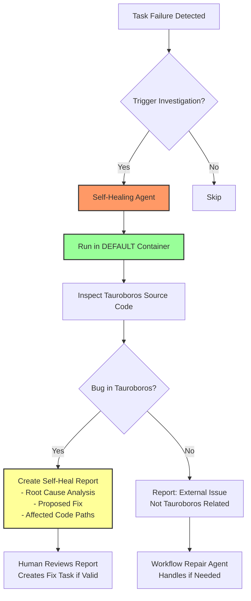

# Fix Self-Healing Implementation Plan

## Problem Statement

The self-healing feature was coded incorrectly. It currently:
1. Treats self-healing as a "smart retry" mechanism for workflow tasks
2. Runs in task-specific contexts (task's container, worktree)
3. Decides whether to restart or keep failed tasks (conflated with repair)

**What it should do:**
1. Investigate if workflow/task failure was caused by a **bug in Tauroboros itself**
2. If Tauroboros bug found: identify root cause, propose solution, create report
3. Always run in **default container** (Tauroboros runs there)
4. **Never** try to fix workflows - that's the repair agent's job

## Architecture Diagram



## Task Breakdown

### Task 1: Rewrite Self-Healing Prompt
**Current:** Asks agent to decide between `restart_task` vs `keep_failed`  
**New:** Focus exclusively on Tauroboros bug investigation

**Changes needed in `src/prompts/prompt-catalog.json`:**
- Remove `recoverability` section from expected output
- Add focus on Tauroboros codebase inspection
- Change output format to identify Tauroboros bugs vs external issues
- Add instruction to search `~/.local/share/effect-solutions/` for patterns

**New prompt structure:**
```json
{
  "diagnosticsSummary": "What was investigated",
  "isTauroborosBug": true|false,
  "rootCause": {
    "description": "What the bug is",
    "affectedFiles": ["src/.../file.ts"],
    "codeSnippet": "relevant code showing the bug"
  },
  "proposedSolution": "How to fix it",
  "implementationPlan": ["step 1", "step 2"],
  "confidence": "high|medium|low",
  "externalFactors": ["list of non-Tauroboros causes if not a bug"]
}
```

### Task 2: Update SelfHealingService to Use Default Container
**File:** `src/runtime/self-healing.ts`

**Changes:**
1. Always use default container image (don't resolve from task)
2. Set `cwd` to Tauroboros source path (not task worktree)
3. No need for `worktreeDir` parameter in session execution
4. Remove `hasOtherActiveTasks` from investigation (not relevant for Tauroboros bugs)

**Key changes:**
```typescript
// OLD: Uses task's container
const imageToUse = resolveContainerImage(input.task, self.settings?.workflow?.container?.image)

// NEW: Always use default container
const imageToUse = self.settings?.workflow?.container?.image || DEFAULT_CONTAINER_IMAGE
```

### Task 3: Update Orchestrator Self-Healing Logic
**File:** `src/orchestrator/self-healing.ts`

**Changes:**
1. `maybeSelfHealTask` should only trigger investigation, NOT modify task state
2. Remove requeuing logic from self-healing
3. Self-healing creates a report - human decides what to do
4. Keep `manualSelfHealRecover` but rename to clarify it's for recovery actions

**New flow:**
```typescript
// Self-healing investigates and reports
const result = yield* context.selfHealingService.investigateFailure({...})

// If Tauroboros bug found, create report and notify
if (result.isTauroborosBug) {
  // Create report, broadcast to UI for human review
  // Do NOT modify task state - let human decide
}
```

### Task 4: Update Types and Database Schema
**Files:** 
- `src/types.ts`
- `src/db/types.ts`
- `src/db/index.ts` (migrations)

**Changes to `SelfHealReport`:**
- Add `isTauroborosBug: boolean`
- Change `recoverable` → `isTauroborosBug` (clearer semantics)
- Remove `recommendedAction` (not self-healing's job)
- Add `affectedFiles: string[]`
- Add `confidence: string`
- Add `externalFactors: string[]`

**Migration needed:**
```sql
ALTER TABLE self_heal_reports 
ADD COLUMN is_tauroboros_bug BOOLEAN DEFAULT FALSE,
ADD COLUMN affected_files JSON DEFAULT '[]',
ADD COLUMN confidence TEXT,
ADD COLUMN external_factors JSON DEFAULT '[]';
```

### Task 5: Update UI Components
**Files:**
- `src/kanban-solid/src/api/selfHeal.ts`
- Components that display self-heal reports

**Changes:**
1. Show `isTauroborosBug` status clearly
2. If Tauroboros bug: show "Create Fix Task" button
3. If not Tauroboros bug: show "Dismiss" or "Send to Repair"
4. Remove "Restart Task" button from self-heal UI (that's repair's job)

### Task 6: Add Self-Healing Trigger Logic
**File:** `src/orchestrator.ts` or execution logic

**Changes:**
1. Define when self-healing should trigger:
   - Task fails with specific error patterns suggesting system issues
   - Repeated failures on same task type
   - Errors mentioning Tauroboros internals
2. Add option to disable auto self-healing (manual only)

### Task 7: Update Tests
**Files:** Test files for self-healing

**Changes:**
1. Update test expectations for new JSON output format
2. Test default container is used
3. Test that task state is not modified by self-healing
4. Test report creation for Tauroboros bugs

### Task 8: Add Self-Healing Enable/Disable Option
**Files:**
- `src/types.ts` - Add to Options interface
- `src/db/migrations.ts` - Add migration
- `src/db.ts` - Update DEFAULT_OPTIONS
- `src/kanban-solid/src/components/modals/OptionsModal.tsx` - Add checkbox
- `src/kanban-solid/src/components/tabs/OptionsTab.tsx` - Add checkbox

**Changes:**
1. Add `selfHealingEnabled: boolean` to Options interface (default: `false`)
2. Create migration 32 to add the option to database with default `'false'`
3. Update `DEFAULT_OPTIONS` in `src/db.ts` to include `selfHealingEnabled: false`
4. Add UI checkbox in OptionsModal (with `DEFAULT_FORM_DATA` update)
5. Add UI checkbox in OptionsTab (with `DEFAULT_FORM_DATA` update)
6. The orchestrator should check this option before triggering self-healing

**Migration:**
```sql
INSERT OR REPLACE INTO options (key, value) VALUES ('self_healing_enabled', 'false');
```

**UI Placement:** Add in the "Session Cleanup & Execution Graph" section or create a new "Advanced" section alongside it.

## Key Clarifications

### Self-Healing vs Repair - Clear Separation

| Aspect | Self-Healing (Tauroboros Bug Hunter) | Repair (Workflow Fixer) |
|--------|--------------------------------------|------------------------|
| **Scope** | Tauroboros system bugs | Workflow task failures |
| **Container** | Default container only | Task-specific container |
| **CWD** | Tauroboros source directory | Task worktree |
| **Output** | Bug report with fix proposal | Repair action decision |
| **Modifies Task?** | **NO** - only reports | **YES** - applies repair action |
| **Who Acts** | Human reviews, creates fix task | Auto-applied or human-guided |

### Self-Healing Trigger Conditions

Self-healing should trigger when:
1. Task fails with error suggesting Tauroboros internals
2. Same task fails multiple times with identical errors
3. Error patterns match known Tauroboros issue signatures
4. Manual trigger from UI ("Investigate System Cause")

Should NOT trigger for:
1. User code compilation errors
2. Test failures in user project
3. Network issues external to Tauroboros
4. Resource exhaustion (disk, memory)

## Implementation Order

1. **Task 8** - Add enable/disable option (foundation - can be done independently)
2. **Task 1** - Rewrite prompt (foundation)
3. **Task 4** - Update types and DB schema (enables new data model)
4. **Task 2** - Update SelfHealingService (uses new types)
5. **Task 3** - Update orchestrator logic (integration)
6. **Task 5** - Update UI components (user-facing)
7. **Task 6** - Add trigger logic (behavior)
8. **Task 7** - Update tests (quality)

## Success Criteria

- [ ] Self-healing enable/disable option added to Options tab
- [ ] Option defaults to disabled (false)
- [ ] Self-healing only triggers when option is enabled
- [ ] Self-healing runs exclusively in default container
- [ ] Self-healing investigates Tauroboros source code, not task worktree
- [ ] Self-healing never modifies task status (only creates reports)
- [ ] Report clearly distinguishes Tauroboros bugs from external issues
- [ ] UI allows human to create fix task from Tauroboros bug report
- [ ] Repair agent remains the only way to fix workflow task state
- [ ] All existing self-healing tests pass with new behavior
