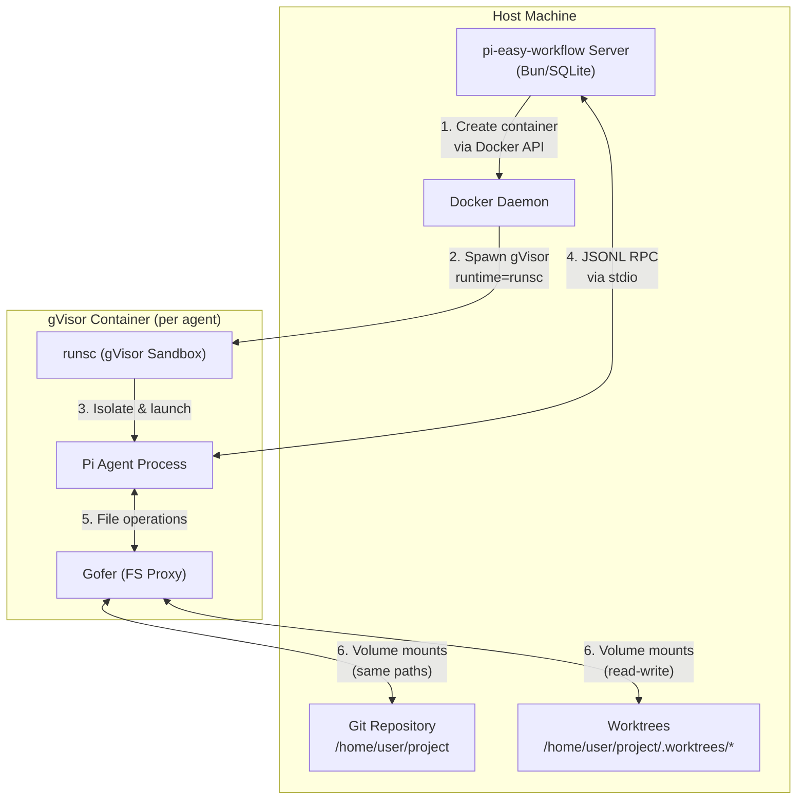
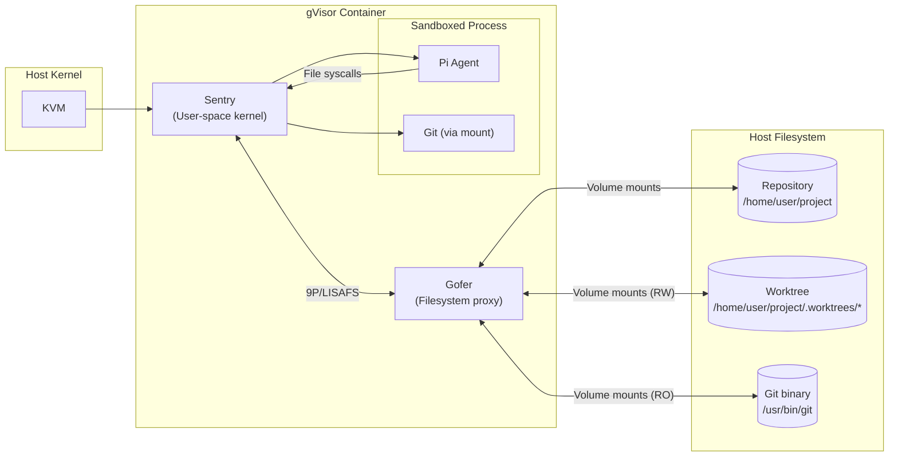
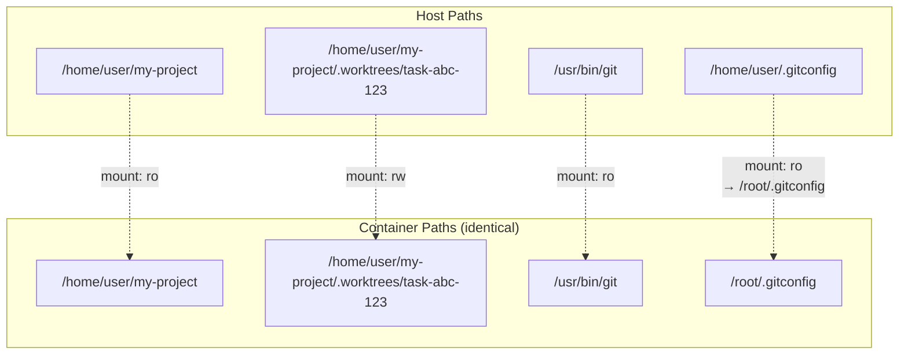
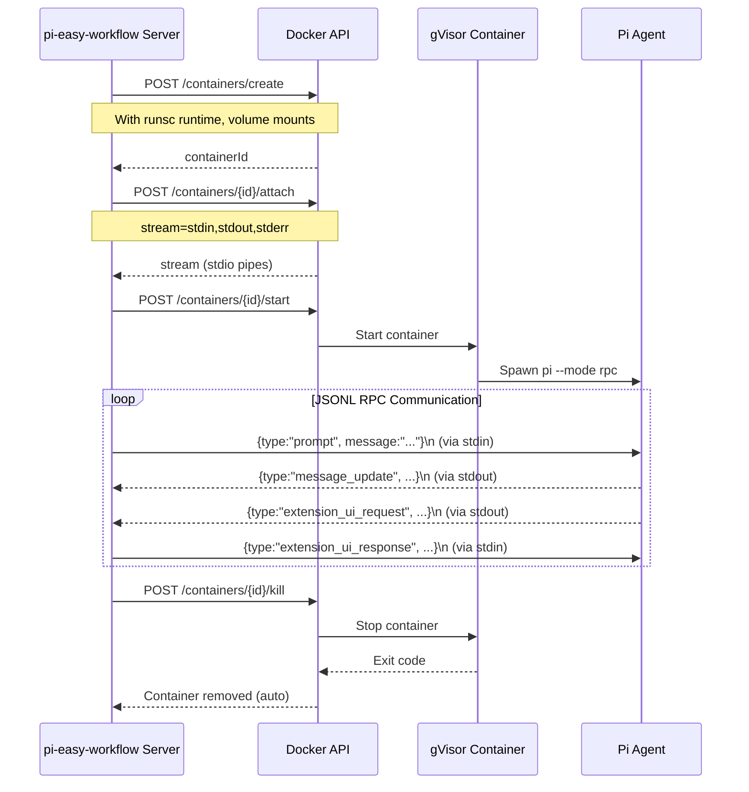
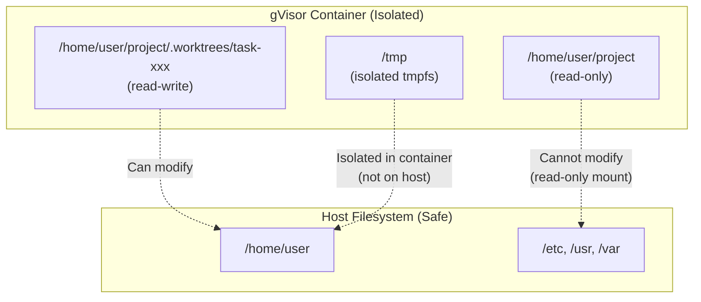

# gVisor Isolation for Pi Agents

## Executive Summary

This document outlines the implementation plan for running Pi agents inside gVisor containers to achieve **filesystem isolation** and **port isolation**. The solution uses Docker with the gVisor (`runsc`) runtime, allowing agents to run with full internet access while being isolated from each other and the host system.

**Key Goals:**
- Filesystem isolation: Agents cannot access files outside their designated worktree
- Port isolation: Multiple agents can run servers on the same port (e.g., port 3000) without conflict
- Network access: Agents retain full internet and local network access for development tasks
- Git compatibility: Worktrees function correctly with identical paths inside/outside containers

---

## Architecture Overview

### High-Level Flow



### Container Architecture Details



---

## Directory Structure Preservation

To ensure git worktrees function correctly, **all paths must be identical** inside and outside the container:



**Critical Requirements:**
1. Base repository mounted read-only at same path
2. Worktree mounted read-write at same path
3. Git binary and config available
4. Node.js/Bun available inside container

---

## Implementation Components

### 1. Docker Image (`docker/pi-agent/Dockerfile`)

```dockerfile
# Base image with Bun and Node
FROM oven/bun:1-alpine

# Install git and other dependencies
RUN apk add --no-cache git openssh-client ca-certificates

# Copy pi binary (or install from npm)
COPY pi /usr/local/bin/pi
RUN chmod +x /usr/local/bin/pi

# Set up git config directory
RUN mkdir -p /root

# Default working directory (overridden at runtime)
WORKDIR /workspace

# Entry point runs pi in RPC mode
ENTRYPOINT ["pi", "--mode", "rpc", "--no-extensions"]
```

### 2. Container Manager (`src/runtime/container-manager.ts`)

New component to manage Docker container lifecycle:

```typescript
interface ContainerConfig {
  sessionId: string;
  worktreeDir: string;        // Same path on host and in container
  repoRoot: string;           // Same path on host and in container
  env?: Record<string, string>;
  networkMode?: string;       // Default: bridge
}

interface ContainerProcess {
  sessionId: string;
  containerId: string;
  stdin: WritableStream;
  stdout: ReadableStream;
  stderr: ReadableStream;
  kill(): Promise<void>;
}

class PiContainerManager {
  constructor(
    private docker: Dockerode,
    private imageName: string = "pi-agent:gvisor"
  ) {}

  async createContainer(config: ContainerConfig): Promise<ContainerProcess>;
  async killContainer(sessionId: string): Promise<void>;
  async cleanup(): Promise<void>;
}
```

### 3. Modified Pi Process (`src/runtime/pi-process.ts`)

Refactor to support both native and containerized execution:

```typescript
interface PiProcessBackend {
  start(): void;
  send(command: object): Promise<void>;
  onEvent(listener: PiEventListener): () => void;
  close(): Promise<void>;
}

// Native implementation (current)
class NativePiProcess implements PiProcessBackend {
  // Current implementation using Bun.spawn
}

// Container implementation (new)
class ContainerPiProcess implements PiProcessBackend {
  // Uses Docker API with gVisor runtime
}
```

### 4. Volume Mount Configuration

```typescript
function createVolumeMounts(
  worktreeDir: string,
  repoRoot: string
): Dockerode.MountSettings[] {
  return [
    // Repository root (read-only)
    {
      Source: repoRoot,
      Target: repoRoot,
      Type: "bind",
      ReadOnly: true,
    },
    // Worktree (read-write)
    {
      Source: worktreeDir,
      Target: worktreeDir,
      Type: "bind",
      ReadOnly: false,
    },
    // Git binary
    {
      Source: "/usr/bin/git",
      Target: "/usr/bin/git",
      Type: "bind",
      ReadOnly: true,
    },
    // Git config
    {
      Source: `${process.env.HOME}/.gitconfig`,
      Target: "/root/.gitconfig",
      Type: "bind",
      ReadOnly: true,
    },
    // SSH keys for git operations
    {
      Source: `${process.env.HOME}/.ssh`,
      Target: "/root/.ssh",
      Type: "bind",
      ReadOnly: true,
    },
  ];
}
```

---

## Docker/GVisor Configuration

### Docker Daemon Setup

Enable gVisor runtime in `/etc/docker/daemon.json`:

```json
{
  "runtimes": {
    "runsc": {
      "path": "/usr/local/bin/runsc",
      "runtimeArgs": [
        "--overlay2=root:self",
        "--file-access=shared"
      ]
    }
  }
}
```

### Container HostConfig

```typescript
const hostConfig: Dockerode.HostConfig = {
  Runtime: "runsc",           // Use gVisor
  Binds: volumeMounts,
  NetworkMode: "bridge",       // Full network access
  AutoRemove: true,            // Clean up after exit
  CapDrop: ["ALL"],            // Drop all capabilities
  SecurityOpt: ["no-new-privileges:true"],
  Tmpfs: {
    "/tmp": "rw,noexec,nosuid,size=100m",
  },
};
```

---

## Communication Protocol

### RPC Message Flow



### Message Types

The following RPC messages must be supported (existing protocol):

**Client → Agent (stdin):**
- `prompt`: Send a prompt to the agent
- `set_model`: Change the AI model
- `set_thinking_level`: Change thinking level
- `get_messages`: Get current conversation
- `steer`: Send a steering message
- `follow_up`: Send a follow-up
- `extension_ui_response`: Respond to UI request

**Agent → Client (stdout):**
- `response`: Response to a command
- `message_update`: Agent message/event
- `tool_call`: Tool execution request
- `extension_ui_request`: UI dialog request
- `agent_end`: Agent finished processing

---

## Port Isolation Strategy

### Problem Statement
Multiple agents may need to run servers on the same port (e.g., `npm run dev` on port 3000).

### Solution

```mermaid
flowchart LR
    subgraph "Agent 1 Container"
        A1["Port 3000"]
    end

    subgraph "Agent 2 Container"
        A2["Port 3000"]
    end

    subgraph "Agent 3 Container"
        A3["Port 3000"]
    end

    subgraph "Host Network"]
        H1["Host Port 3001<br/>→ Agent 1:3000"]
        H2["Host Port 3002<br/>→ Agent 2:3000"]
        H3["Host Port 3003<br/>→ Agent 3:3000"]
    end

    A1 -.->|"Port mapping"| H1
    A2 -.->|"Port mapping"| H2
    A3 -.->|"Port mapping"| H3
```

**Implementation:**
- Agents use their preferred ports internally (3000, 8080, etc.)
- Server tracks port allocations per session
- Optional: Map container ports to host ports if external access needed

```typescript
class PortAllocator {
  private usedPorts = new Set<number>();
  private basePort = 30000;
  private maxPort = 40000;

  allocatePort(): number {
    for (let port = this.basePort; port < this.maxPort; port++) {
      if (!this.usedPorts.has(port)) {
        this.usedPorts.add(port);
        return port;
      }
    }
    throw new Error("No available ports");
  }

  releasePort(port: number): void {
    this.usedPorts.delete(port);
  }
}
```

---

## File System Isolation Guarantees

### What Is Protected



### Attack Scenarios Prevented

| Attack | Prevention |
|--------|-----------|
| `rm -rf /` | Root filesystem is read-only |
| `rm -rf ~` | Home directory not mounted (except specific paths) |
| `echo "evil" >> ~/.bashrc` | Home directory not writable |
| Write to other worktrees | Only current worktree is writable |
| Read SSH keys | Mounted read-only, container can't modify |
| Network scanning | Limited by network namespace (but internet allowed) |

---

## Testing Strategy

### E2E Test Requirements

**NO MOCKS** - All tests use real:
- Docker daemon with gVisor runtime
- Git repositories and worktrees
- Pi binary and AI models
- Filesystem operations
- Network operations

### Test Scenarios

#### Test 1: Basic Container Lifecycle
```typescript
describe("Container Lifecycle", () => {
  test("creates and destroys container successfully", async () => {
    const container = await containerManager.createContainer({
      sessionId: "test-1",
      worktreeDir: "/tmp/test-worktree",
      repoRoot: "/tmp/test-repo",
    });

    expect(container.containerId).toBeDefined();
    expect(container.stdin).toBeWritable();
    expect(container.stdout).toBeReadable();

    await containerManager.killContainer("test-1");
    // Verify container is removed
    const containers = await docker.listContainers({ all: true });
    expect(containers.filter(c => c.Names.includes("test-1"))).toHaveLength(0);
  });
});
```

#### Test 2: Filesystem Isolation
```typescript
describe("Filesystem Isolation", () => {
  test("agent can write to worktree but not repo root", async () => {
    // Setup: Create repo and worktree
    const repoDir = await createTempGitRepo();
    const worktreeDir = await createWorktree(repoDir, "test-task");

    // Spawn agent
    const container = await containerManager.createContainer({
      sessionId: "test-2",
      worktreeDir,
      repoRoot: repoDir,
    });

    // Send prompt to create file in worktree
    await sendRpcCommand(container, {
      type: "prompt",
      message: "Create a file at test.txt with content 'hello'",
    });

    // Verify file exists in worktree
    expect(await readFile(`${worktreeDir}/test.txt`)).toBe("hello");

    // Send prompt to modify repo root
    await sendRpcCommand(container, {
      type: "prompt",
      message: "Try to create a file at ../README.md",
    });

    // Verify file was NOT created in repo root
    expect(await fileExists(`${repoDir}/README.md`)).toBe(false);

    await containerManager.killContainer("test-2");
  });
});
```

#### Test 3: Git Operations in Worktree
```typescript
describe("Git Operations", () => {
  test("agent can use git commands in worktree", async () => {
    const repoDir = await createTempGitRepo();
    const worktreeDir = await createWorktree(repoDir, "git-test");

    const container = await containerManager.createContainer({
      sessionId: "test-3",
      worktreeDir,
      repoRoot: repoDir,
    });

    // Send prompt to use git
    await sendRpcCommand(container, {
      type: "prompt",
      message: "Run 'git status' and tell me what branch I'm on",
    });

    // Verify response contains branch info
    const events = await collectEvents(container, 5000);
    const lastMessage = events.findLast(e => e.type === "message_update");
    expect(lastMessage?.text).toContain("git-test");

    await containerManager.killContainer("test-3");
  });
});
```

#### Test 4: Port Isolation
```typescript
describe("Port Isolation", () => {
  test("multiple agents can use same port", async () => {
    const repoDir = await createTempGitRepo();

    // Create two worktrees
    const worktree1 = await createWorktree(repoDir, "port-test-1");
    const worktree2 = await createWorktree(repoDir, "port-test-2");

    // Create package.json with server on port 3000 in both
    await writeFile(
      `${worktree1}/package.json`,
      JSON.stringify({ scripts: { start: "npx http-server -p 3000" } })
    );
    await writeFile(
      `${worktree2}/package.json`,
      JSON.stringify({ scripts: { start: "npx http-server -p 3000" } })
    });

    // Spawn two containers
    const container1 = await containerManager.createContainer({
      sessionId: "test-4a",
      worktreeDir: worktree1,
      repoRoot: repoDir,
    });
    const container2 = await containerManager.createContainer({
      sessionId: "test-4b",
      worktreeDir: worktree2,
      repoRoot: repoDir,
    });

    // Both start servers on port 3000 inside their containers
    await sendRpcCommand(container1, {
      type: "prompt",
      message: "Run 'npm start' in background",
    });
    await sendRpcCommand(container2, {
      type: "prompt",
      message: "Run 'npm start' in background",
    });

    // Wait for servers to start
    await sleep(3000);

    // Both should be running without port conflict
    // (Containers have isolated network namespaces)
    const ps1 = await execInContainer(container1, "pgrep -f http-server");
    const ps2 = await execInContainer(container2, "pgrep -f http-server");

    expect(ps1.exitCode).toBe(0);
    expect(ps2.exitCode).toBe(0);

    await containerManager.killContainer("test-4a");
    await containerManager.killContainer("test-4b");
  });
});
```

#### Test 5: Full Workflow Execution
```typescript
describe("Full Workflow Execution", () => {
  test("completes task from creation to success", async () => {
    // Setup: Create a real git repo with a simple task
    const projectDir = await createTempDir("pi-workflow-test-");
    await exec(`git init ${projectDir}`);
    await writeFile(`${projectDir}/README.md`, "# Test Project");
    await exec(`git -C ${projectDir} add . && git -C ${projectDir} commit -m "initial"`);

    // Initialize pi-easy-workflow
    const db = new PiKanbanDB(`${projectDir}/.pi/easy-workflow/db.sqlite`);

    // Create a task
    const task = db.createTask({
      id: "test-task-1",
      name: "Add greeting function",
      prompt: "Create a file called greeting.js that exports a function sayHello(name) that returns 'Hello, {name}!'",
      branch: "main",
      status: "backlog",
    });

    // Create worktree for task
    const worktree = new WorktreeLifecycle({ baseDirectory: projectDir });
    const worktreeInfo = await worktree.createForTask(task.id, "test-task-branch", "main");

    // Execute task in container
    const orchestrator = new PiOrchestrator(
      db,
      () => {}, // broadcast
      (sessionId) => `http://localhost/sessions/${sessionId}`,
      projectDir
    );

    // Override to use container backend
    orchestrator.useContainerBackend(containerManager);

    // Start task execution
    const run = await orchestrator.startSingle(task.id);

    // Wait for completion (with timeout)
    const result = await waitForRunCompletion(run.id, 60000);

    // Assertions
    expect(result.status).toBe("completed");

    // Verify file was created in worktree
    const greetingFile = `${worktreeInfo.directory}/greeting.js`;
    expect(await fileExists(greetingFile)).toBe(true);

    const content = await readFile(greetingFile);
    expect(content).toContain("sayHello");
    expect(content).toContain("Hello");

    // Verify git history
    const gitLog = await exec(`git -C ${worktreeInfo.directory} log --oneline`);
    expect(gitLog.stdout).toContain("Add greeting function");

    // Cleanup
    await worktree.complete(worktreeInfo.directory, {
      branch: worktreeInfo.branch,
      targetBranch: "main",
      shouldMerge: false,
      shouldRemove: true,
    });
  }, 120000); // 2 minute timeout
});
```

### Test Infrastructure

#### Test Setup Script
```bash
#!/bin/bash
# scripts/setup-e2e-tests.sh

set -e

echo "Setting up E2E test environment..."

# Check Docker
if ! command -v docker &> /dev/null; then
    echo "Error: Docker not installed"
    exit 1
fi

# Check gVisor
if ! command -v runsc &> /dev/null; then
    echo "Installing gVisor..."
    curl -fsSL https://gvisor.dev/archive.key | sudo gpg --dearmor -o /usr/share/keyrings/gvisor-archive-keyring.gpg
    echo "deb [arch=$(dpkg --print-architecture) signed-by=/usr/share/keyrings/gvisor-archive-keyring.gpg] https://storage.googleapis.com/gvisor/releases release main" | sudo tee /etc/apt/sources.list.d/gvisor.list
    sudo apt-get update && sudo apt-get install -y runsc
fi

# Configure Docker runtime
if ! grep -q "runsc" /etc/docker/daemon.json 2>/dev/null; then
    echo "Configuring Docker for gVisor..."
    sudo runsc install
    sudo systemctl reload docker
fi

# Build pi-agent image
echo "Building pi-agent Docker image..."
docker build -t pi-agent:gvisor -f docker/pi-agent/Dockerfile .

# Verify gVisor works
echo "Testing gVisor..."
docker run --runtime=runsc --rm pi-agent:gvisor pi --version

echo "E2E test environment ready!"
```

#### Test Utilities
```typescript
// tests/e2e/utils.ts

export async function createTempGitRepo(): Promise<string> {
  const dir = await createTempDir("git-repo-");
  await exec(`git init ${dir}`);
  await exec(`git -C ${dir} config user.email "test@test.com"`);
  await exec(`git -C ${dir} config user.name "Test"`);
  await writeFile(`${dir}/README.md`, "# Test");
  await exec(`git -C ${dir} add . && git -C ${dir} commit -m "init"`);
  return dir;
}

export async function createWorktree(
  repoDir: string,
  name: string
): Promise<string> {
  const worktreeDir = `${repoDir}/.worktrees/${name}`;
  await exec(`git -C ${repoDir} worktree add -b ${name} ${worktreeDir}`);
  return worktreeDir;
}

export async function sendRpcCommand(
  container: ContainerProcess,
  command: object
): Promise<void> {
  const line = JSON.stringify(command) + "\n";
  await container.stdin.write(line);
}

export async function collectEvents(
  container: ContainerProcess,
  timeoutMs: number
): Promise<any[]> {
  const events: any[] = [];
  const reader = container.stdout.getReader();
  const decoder = new TextDecoder();

  const timeout = setTimeout(() => {
    reader.cancel();
  }, timeoutMs);

  try {
    while (true) {
      const { done, value } = await reader.read();
      if (done) break;

      const chunk = decoder.decode(value, { stream: true });
      const lines = chunk.split("\n").filter(l => l.trim());

      for (const line of lines) {
        try {
          events.push(JSON.parse(line));
        } catch {
          // Ignore non-JSON lines
        }
      }
    }
  } finally {
    clearTimeout(timeout);
  }

  return events;
}
```

---

## Implementation Phases

### Phase 1: Infrastructure
- [ ] Create Docker image for pi-agent
- [ ] Set up gVisor runtime configuration
- [ ] Create `PiContainerManager` class
- [ ] Implement basic container lifecycle (create, start, stop)
- [ ] Create example env file (env.example)
- [ ] Write E2E setup script

**Deliverable:** Can create and destroy gVisor containers programmatically

### Phase 2: RPC Integration
- [ ] Implement stdio streaming via Docker API
- [ ] Create `ContainerPiProcess` backend
- [ ] Integrate with existing `PiRpcProcess` class
- [ ] Test RPC command/response flow
- [ ] Handle extension UI requests

**Deliverable:** Can send prompts and receive responses from containerized agents

### Phase 3: Filesystem Integration
- [ ] Implement volume mount configuration
- [ ] Preserve directory structure (same paths inside/outside)
- [ ] Test git operations in worktrees
- [ ] Test file isolation (can't modify repo root)
- [ ] Handle SSH keys for git operations

**Deliverable:** Agents can use git and edit files in their worktree only

### Phase 4: Port Isolation
- [ ] Implement port allocator
- [ ] Test multiple agents with same internal port
- [ ] Document port mapping strategy
- [ ] Add port configuration to task options

**Deliverable:** Multiple agents can run servers on port 3000 simultaneously

### Phase 5: Integration & E2E Testing
- [ ] Integrate with orchestrator
- [ ] Write full workflow E2E tests
- [ ] Performance testing (startup time, overhead)
- [ ] Security testing (attempted breakouts)
- [ ] Documentation

**Deliverable:** Complete end-to-end workflow tests pass

### Phase 6: Production Hardening
- [ ] Resource limits (CPU, memory)
- [ ] Timeout handling
- [ ] Cleanup on crashes
- [ ] Monitoring and logging
- [ ] Configuration management
 
**Deliverable:** Production-ready with monitoring

---

## Configuration

### Environment Variables

```bash
# Runtime selection
PI_EASY_WORKFLOW_RUNTIME=native|container  # Default: native

# Container settings
PI_EASY_WORKFLOW_CONTAINER_IMAGE=pi-agent:gvisor
PI_EASY_WORKFLOW_CONTAINER_RUNTIME=runsc

# Resource limits
PI_EASY_WORKFLOW_CONTAINER_MEMORY_MB=512
PI_EASY_WORKFLOW_CONTAINER_CPU_COUNT=1

# Port allocation
PI_EASY_WORKFLOW_PORT_RANGE_START=30000
PI_EASY_WORKFLOW_PORT_RANGE_END=40000

# Docker socket
DOCKER_SOCKET=/var/run/docker.sock
```

### Task-Level Configuration
```typescript
interface TaskOptions {
  // ... existing options
  
  // Container settings (optional, override globals)
  container?: {
    enabled?: boolean;
    memoryMb?: number;
    cpuCount?: number;
    ports?: number[];  // Ports to expose
  };
}
```
---

## Security Checklist

- [ ] Drop all capabilities (`CapDrop: ["ALL"]`)
- [ ] Enable `no-new-privileges`
- [ ] Read-only root filesystem
- [ ] Isolated /tmp (tmpfs)
- [ ] No access to Docker socket inside containers
- [ ] Resource limits (prevent DoS)
- [ ] Network isolation per container
- [ ] Container cleanup on exit
- [ ] Audit logging for container operations

---

## Rollback Strategy

If issues arise:

1. **Configuration flag** to disable containers:
   ```bash
   PI_EASY_WORKFLOW_RUNTIME=native
   ```

2. **Feature flag** per task:
   ```typescript
   task.options.container = { enabled: false }
   ```

3. **Emergency stop** command to kill all containers

---


## References

- [gVisor Documentation](https://gvisor.dev/docs/)
- [Docker API SDK](https://github.com/apocas/dockerode)
- [Pi RPC Mode](https://github.com/mariozechner/pi-mono/blob/main/packages/coding-agent/src/modes/rpc/)
- [gVisor Filesystem](https://gvisor.dev/docs/user_guide/filesystem/)
- [Linux Worktrees](https://git-scm.com/docs/git-worktree)

- pi Source code - `/home/jmarceno/Projects/cloned/pi-mono/`
